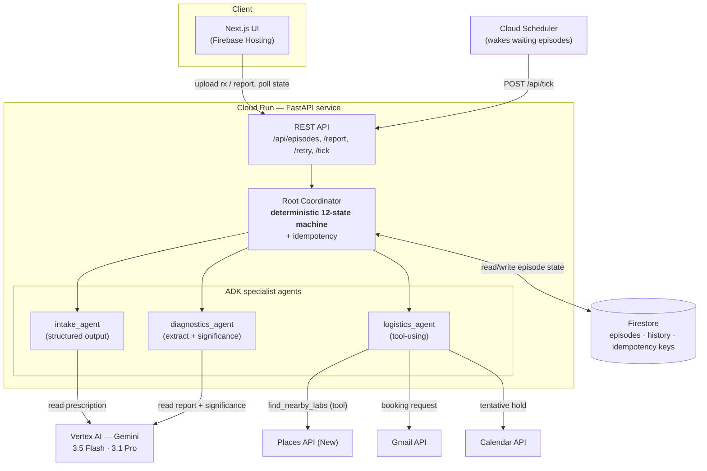
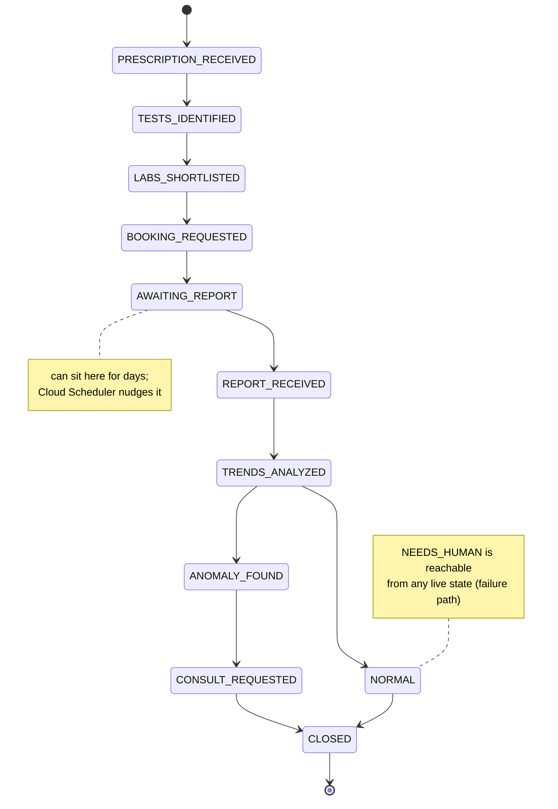

# Architecture — Care Episode Agent

## The idea in one line

One medical episode carried forward **autonomously over days** — a patient uploads
a prescription; the agent identifies and prioritises the tests, finds nearby labs,
requests bookings, then **waits**, and resumes when the report arrives to compare
against history and book a follow-up **only if something meaningfully changed.**

The thing being demonstrated is not document reading — it is an agent acting across
multiple systems, over time, deciding at each fork whether to act.

## System diagram



## The state machine

Every transition is written to Firestore **before** the next step runs, so a
scale-to-zero container that dies mid-episode resumes from exactly where it stopped.
`NEEDS_HUMAN` is reachable from any live state — the failure path.



## Agents (built on ADK)

A **deterministic root coordinator** (`coordinator.py`) reads episode state and
decides which specialist runs next, then writes state back. It is deliberately
*not* LLM-driven: a medical episode must advance safely, idempotently, and
resumably, so an LLM never decides state transitions. The intelligence lives in
three ADK `LlmAgent`s:

| Agent | Framework | Model | What it does |
|---|---|---|---|
| `intake_agent` | ADK `LlmAgent`, structured output | Gemini 3.5 Flash | Reads the prescription (image/PDF, incl. handwriting), extracts diagnosis / medicines / tests, classifies each test urgent vs routine. |
| `logistics_agent` | ADK `LlmAgent`, **tool-using** | Gemini 3.5 Flash | Calls a `find_nearby_labs` tool (Google Places), then reasons to pick the best lab (open · rating · distance). Booking = a real Gmail request email + a tentative Calendar hold. |
| `diagnostics_agent` | ADK `LlmAgent`, structured output | Flash (extract) + **Gemini 3.1 Pro** (significance) | Extracts report values **and the reference ranges printed on the report itself**, computes flags/trends vs the patient's history (deterministic), then decides significance — book a consult only if a value is out of range or trending adverse. |

## Resilience & discipline

- **Idempotency.** Every booking claims a key `{episode_id}:{test_code}:{attempt}`
  in Firestore *before* the side effect (an atomic `create`). Cloud Scheduler can
  fire twice and a crash can land mid-send — neither produces a duplicate.
- **State-first.** Transitions persist before the next step; the episode is fully
  reconstructable from Firestore.
- **Model routing.** Flash for the ~90% extraction/classification work; a Pro model
  only for the one significance decision that needs reasoning. Never Pro in a loop.
- **Medical safety.** The agent summarises and flags, never diagnoses; every
  analysis carries a disclaimer; unreadable/ambiguous inputs go to `NEEDS_HUMAN`
  rather than being guessed.

## Data model (Firestore)

```
episodes/{episode_id}                      the Episode object (the API contract shape)
results/{patient_id}/history/{test_code}   prior readings — the cross-episode memory
idempotency/{key}                          one doc per claimed action
```

The `Episode` object and its 12 states are the frozen contract shared by backend
and frontend (`backend/docs/api-contract.md`).
